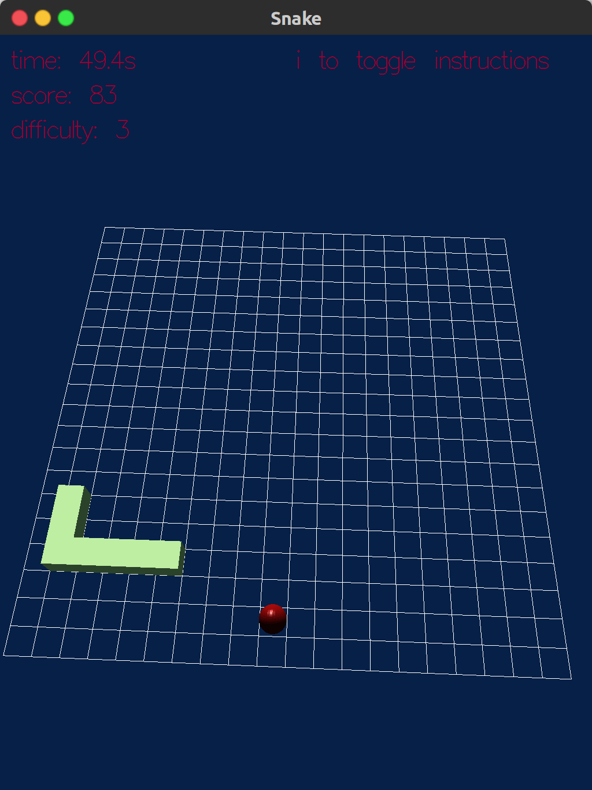
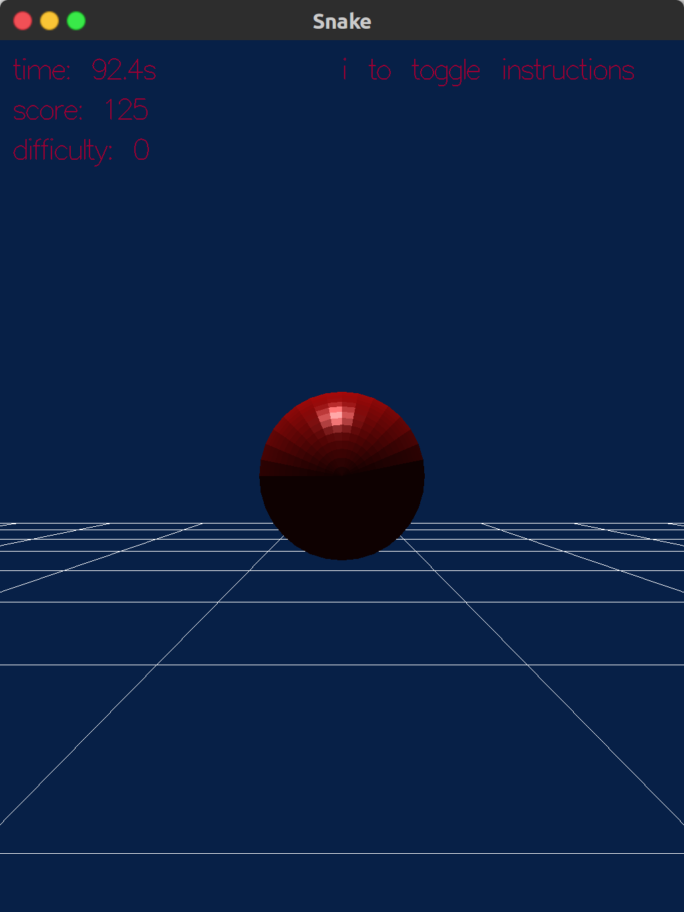
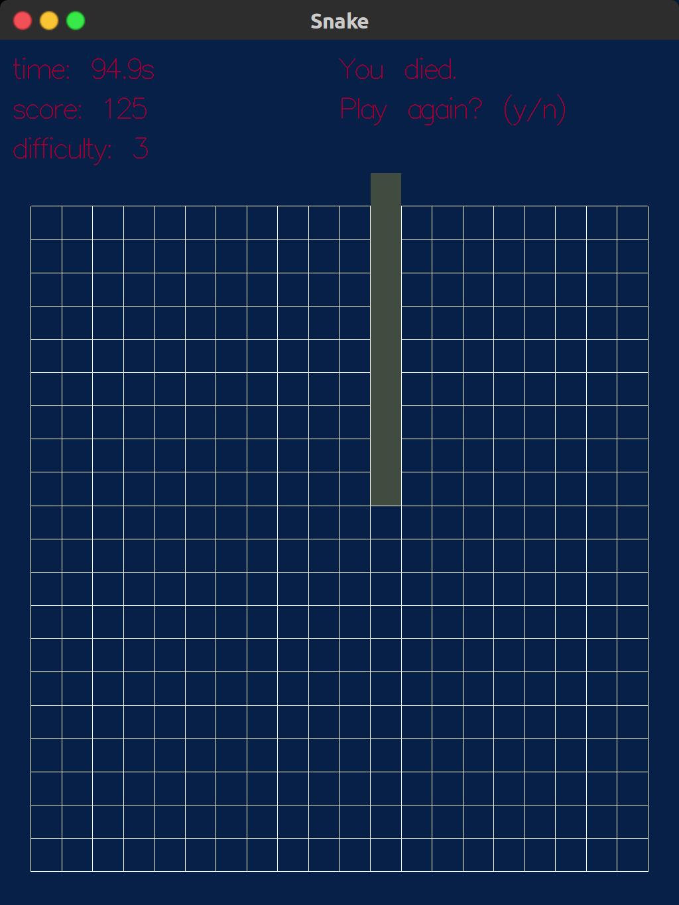

# glsnake

A 3D Snake game implementation in OpenGL. Rules/gameplay as in classic snake.

3 toggleable camera perspectives available: orthographic, 2D view; perspective 3D view from above the board that you can control and move; a perspective 3D camera from the point of view of the snake’s head.   
<p float="left">
  
  
  
</p>


## System requirements
Linux 

## Building
```
make
```

## Running
```
./snake
```
